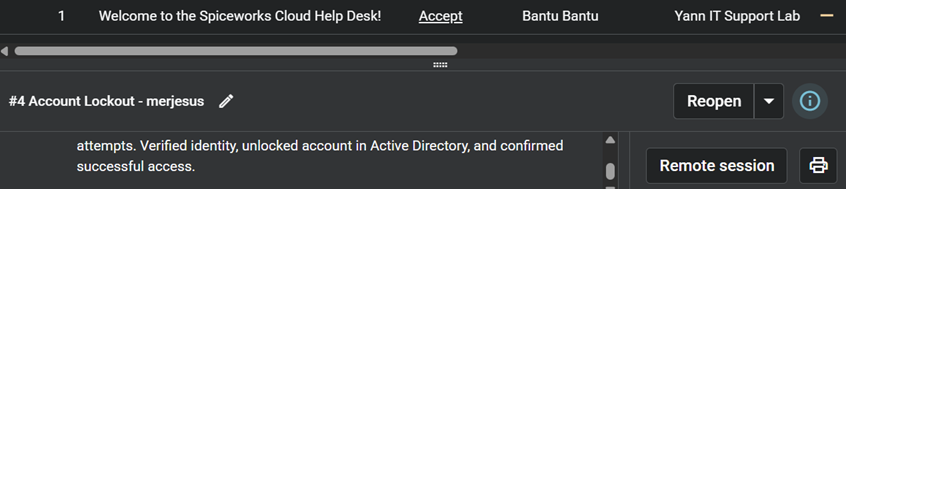

# Bantu – IT Support & Cybersecurity Portfolio

## About Me

Aspiring IT Support and Cybersecurity professional with hands-on experience in Active Directory, troubleshooting, networking, Windows administration, and technical support.

## Skills

* Active Directory
* Password Reset
* User & Group Management
* Troubleshooting
* Networking Fundamentals
* Windows 10/11
* Microsoft 365
* Ticketing Systems

## Projects / Labs

### Active Directory Home Lab

* Created users and groups
* Managed permissions
* Reset passwords and unlocked accounts

### Networking Lab

* Used ping, ipconfig, nslookup, and tracert
* Basic network troubleshooting

## Certifications

* CompTIA Security+

## Contact

* LinkedIn: https://www.linkedin.com/in/bantu-it

## Projects / Labs
### Active Directory Home Lab
- Created users and groups
- Managed permissions
- Reset passwords and unlocked accounts
###  AD User Permissions
Created users, configured permissions, and managed account settings in Active Directory

### Finance Group Membership
Assigned users to security groups for department-based access control.

### Shared Folder Access
Configured shared folder permissions and verified user access.

### Password Reset
Reset passwords in Active Directory and Help Desk ticketing system.

### Account Lockout
Unlocked user accounts in Active Directory.

### Printer Ticket
Created and handled printer troubleshooting ticket.

### Printer Not Responding
Troubleshot printer issue through ticketing system.

### Ticket List
Help desk ticket overview in Spiceworks.

