# Bantu – IT Support & Cybersecurity Portfolio

## About Me

Aspiring IT Support and Cybersecurity professional with hands-on experience in Active Directory, troubleshooting, networking, Windows administration, and technical support.

## Skills

* Active Directory
* Password Reset
* User & Group Management
* Troubleshooting
* Networking Fundamentals
* Windows 10/11
* Microsoft 365
* Ticketing Systems

## Projects / Labs

### Active Directory Home Lab

* Created users and groups
* Managed permissions
* Reset passwords and unlocked accounts

### Group Policy Lab

* Configured password policies
* Restricted Control Panel access
* Applied user settings using Group Policy

#### GPO Configuration
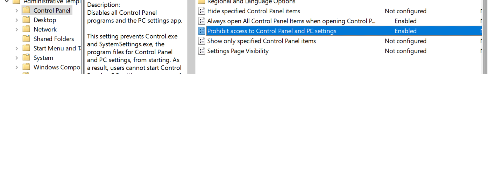

#### Policy Result / Test
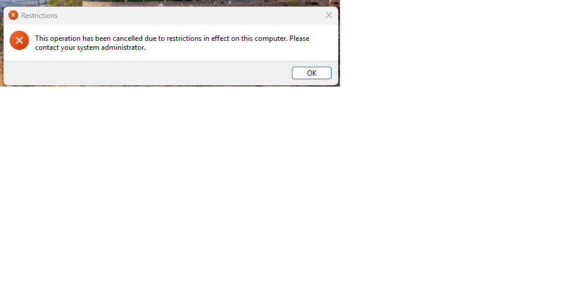

### Networking Lab

• Used ipconfig to view IP configuration and network settings  
• Used ping to test network connectivity  
• Used nslookup to verify DNS resolution  

#### IP Configuration

#### Ping Test
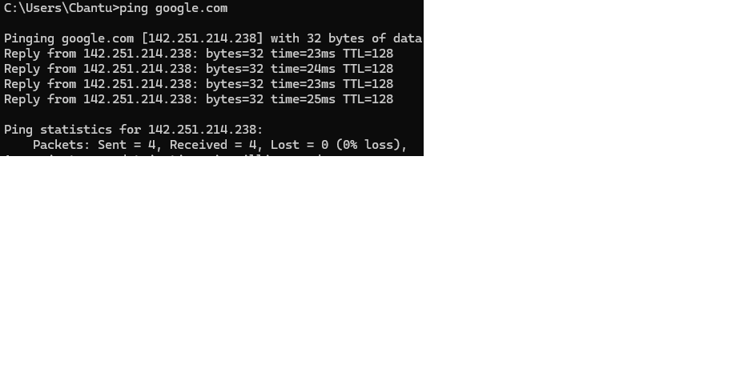

#### DNS Lookup
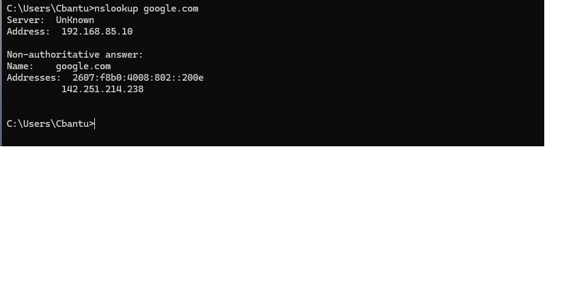

## Certifications

* CompTIA Security+

## Contact

* LinkedIn: https://www.linkedin.com/in/bantu-it

## Projects / Labs
 
### Active Directory Home Lab
- Created users and groups
- Managed permissions
- Reset passwords and unlocked accounts
###  AD User Permissions
Created users, configured permissions, and managed account settings in Active Directory
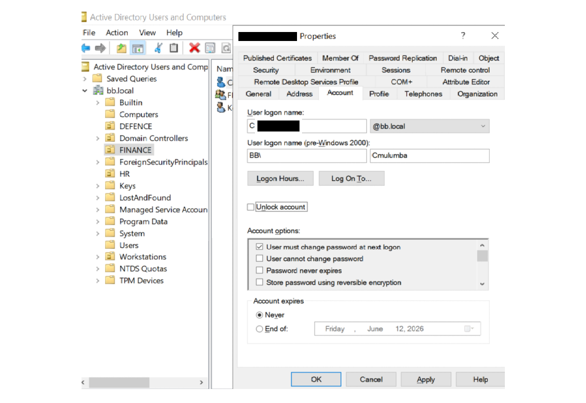
### Finance Group Membership
Assigned users to security groups for department-based access control.
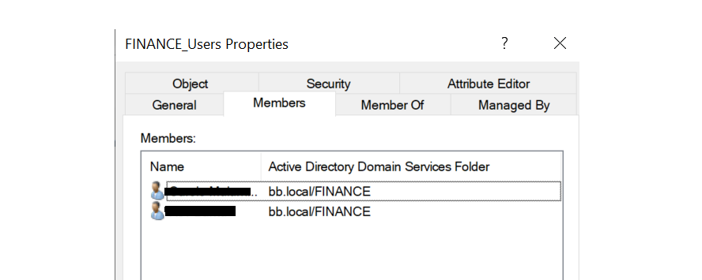

### Shared Folder Access
Configured shared folder permissions and verified user access.
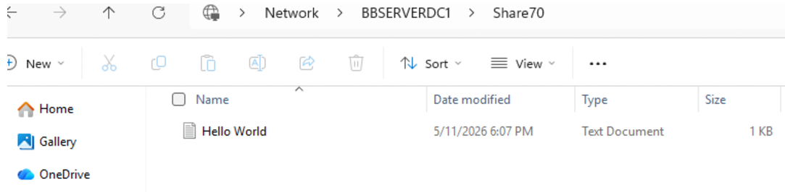

### Password Reset
Reset passwords in Active Directory and Help Desk ticketing system.

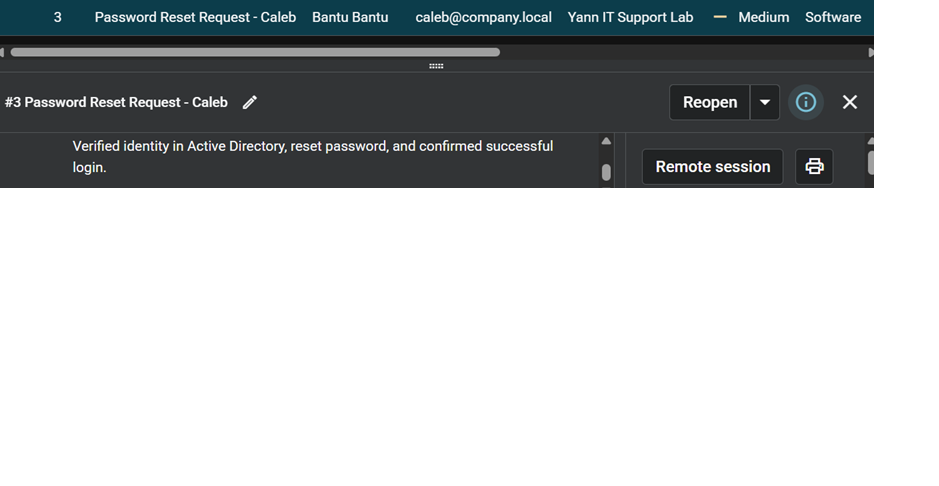

### Account Lockout
Unlocked user accounts in Active Directory.

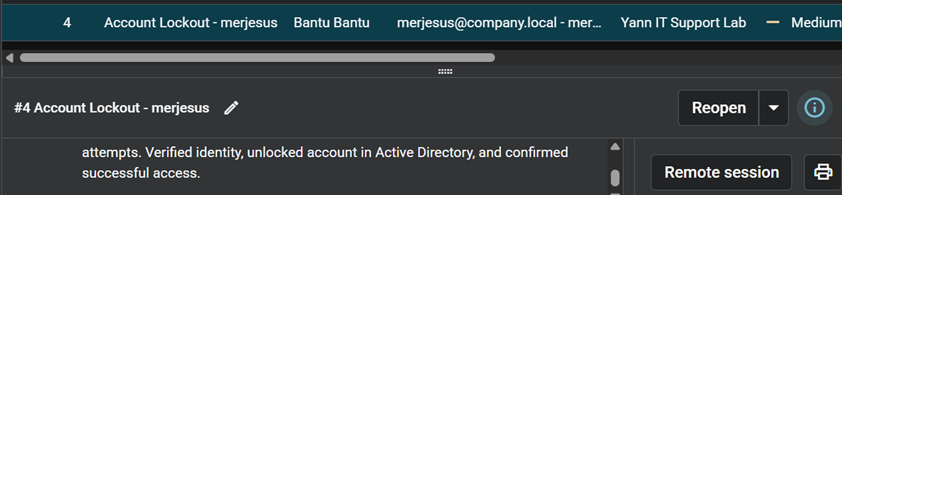

### Printer Ticket
Created and handled printer troubleshooting ticket.

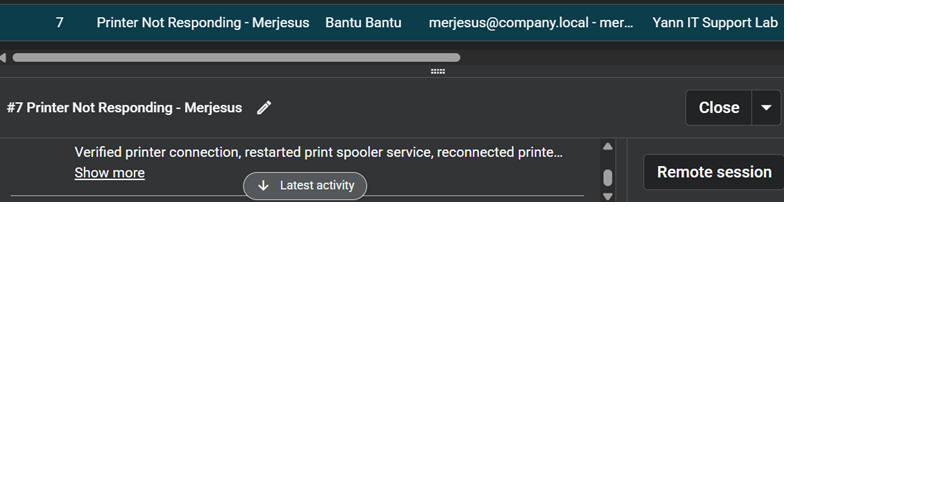

### Printer Not Responding
Troubleshot printer issue through ticketing system.

### Ticket List
Help desk ticket overview in Spiceworks.

### IT Support Ticketing System Lab (Spiceworks)
- Created and resolved IT support tickets in Spiceworks Help Desk
- Reset passwords and unlocked user accounts in Active Directory
- Managed shared folder permissions and access issues
- Resolved software installation problems (Microsoft Office)
- Added resolution notes and closed completed tickets

  ## Microsoft 365 Administration Labs

### User Management
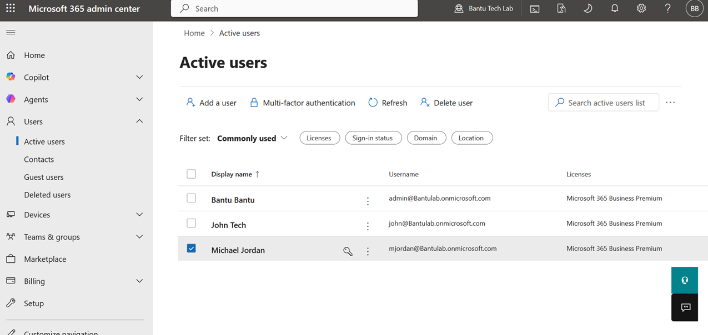

### Password Reset
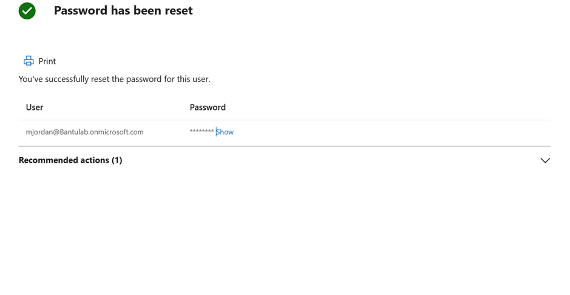

### MFA Enabled
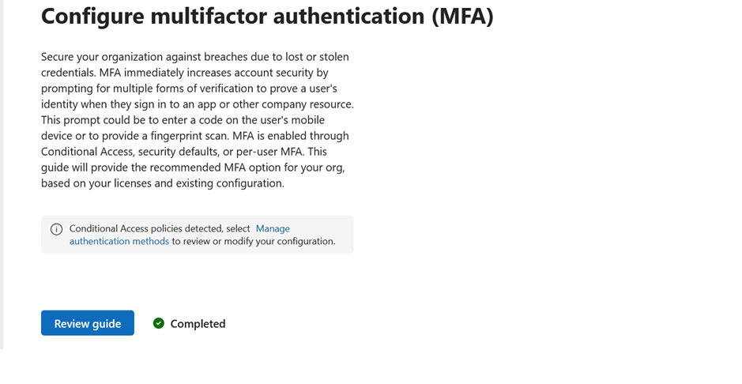

### Block Sign-In
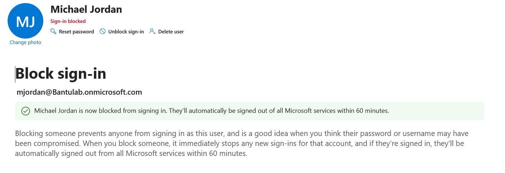

### Security Group Membership
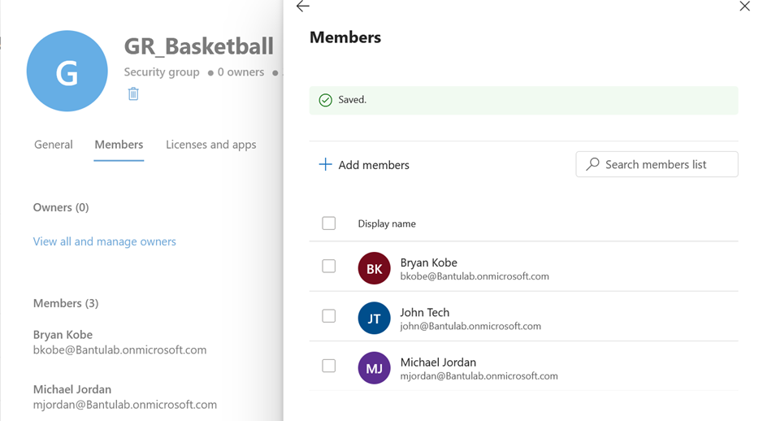

## Microsoft 365 Administration Lab

### Tasks Completed
1. Created a Microsoft Team (IT Support Team)
2. Managed Microsoft 365 Groups and Team Memberships
3. Created and Managed User Accounts in Microsoft Entra ID
4. Configured Multi-Factor Authentication (MFA)
5. Reviewed User Audit Logs
6. Registered an Application in Microsoft Entra ID
7. Reviewed Application Configuration and Settings

### Skills Demonstrated
- Microsoft 365 Administration
- Microsoft Entra ID
- User Management
- Multi-Factor Authentication (MFA)
- Audit Logging
- Application Registration
- Identity and Access Management (IAM)

## Microsoft 365 Administration Lab

### Objectives
- Create and manage Microsoft 365 Groups
- Configure Shared Mailboxes
- Assign mailbox permissions
- Create Distribution Lists
- Manage Teams Channels
- Configure user access and collaboration resources

### Shared Mailbox Configuration

#### Shared Mailbox Overview
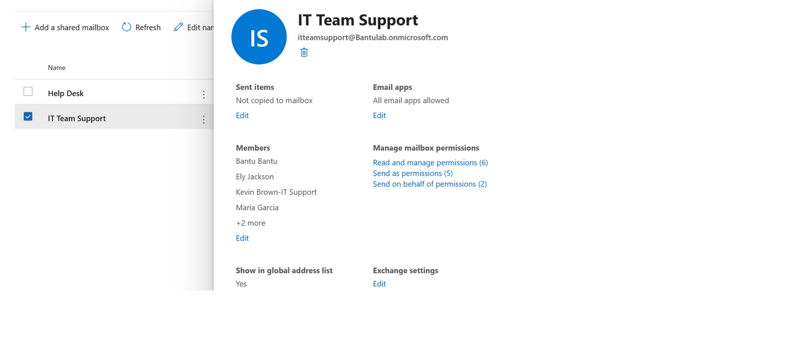

#### Shared Mailbox Members
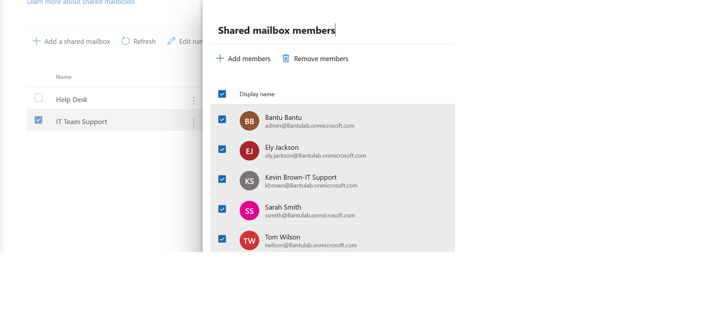

#### Full Access Permissions
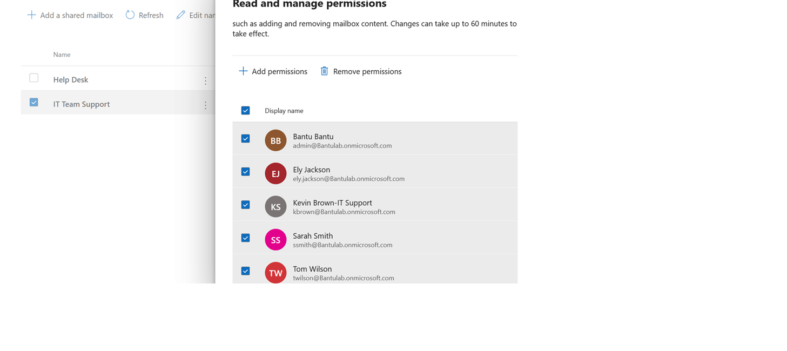

#### Send on Behalf Permissions

### Distribution Lists

#### Distribution List Overview
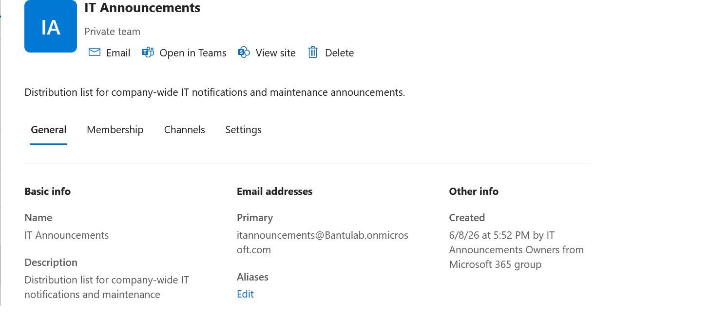

#### Distribution List Members
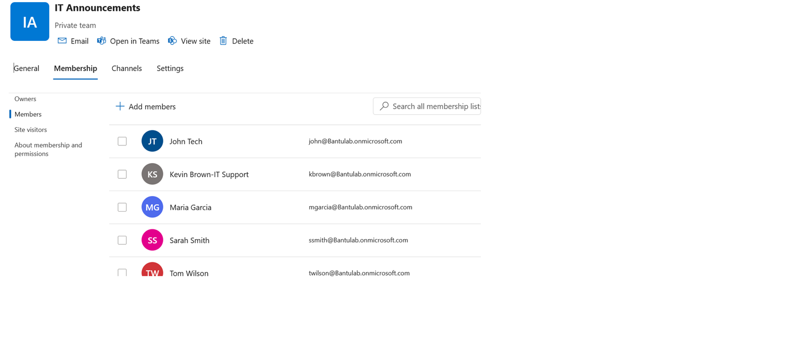

### Microsoft Teams Channels

#### Teams Channels Overview
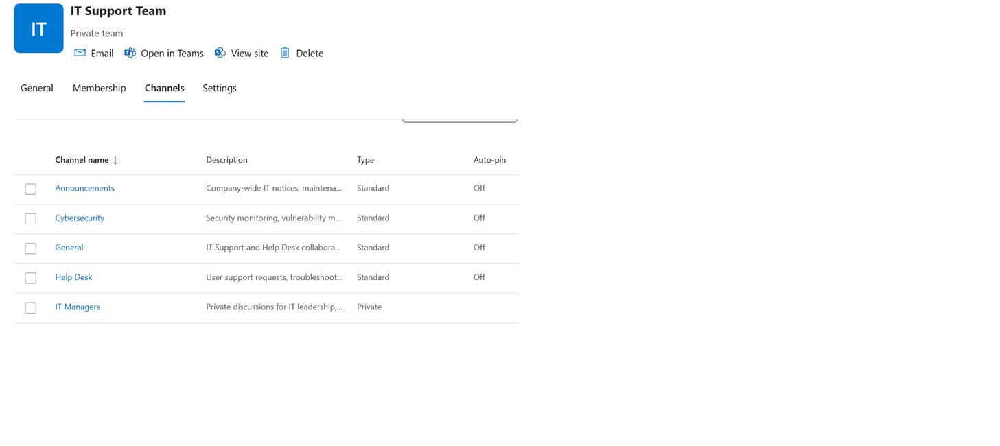

